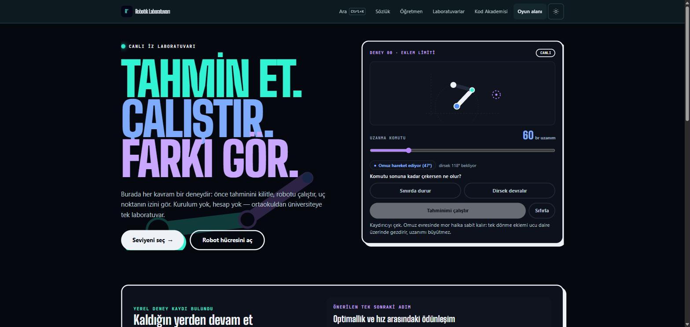
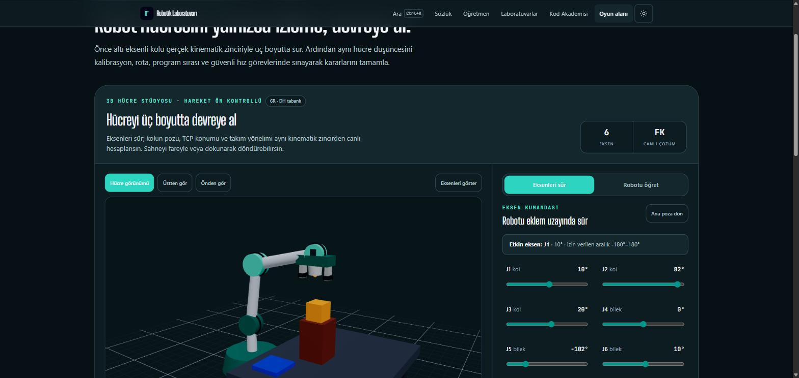
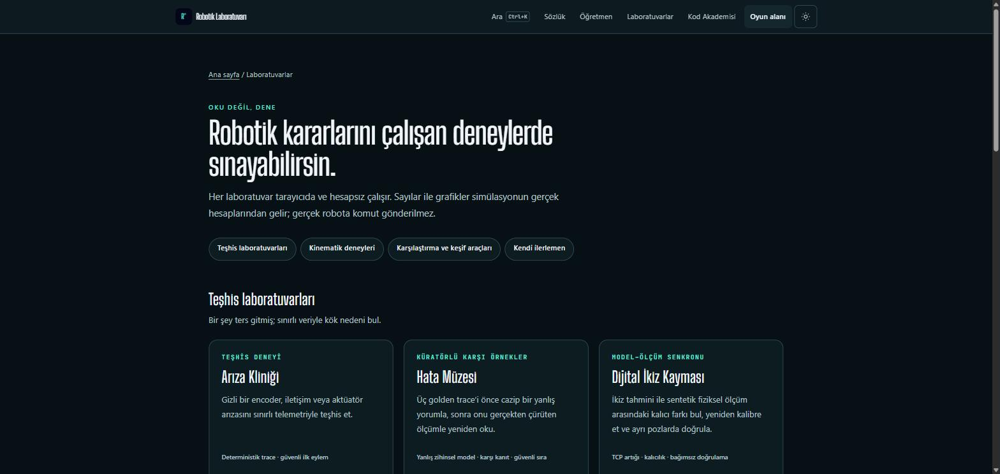
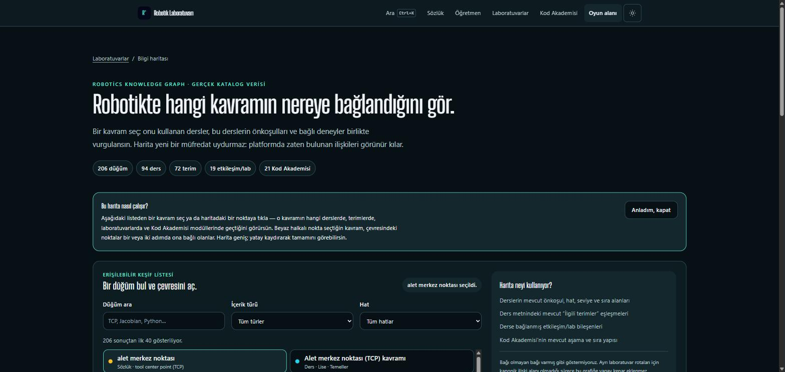
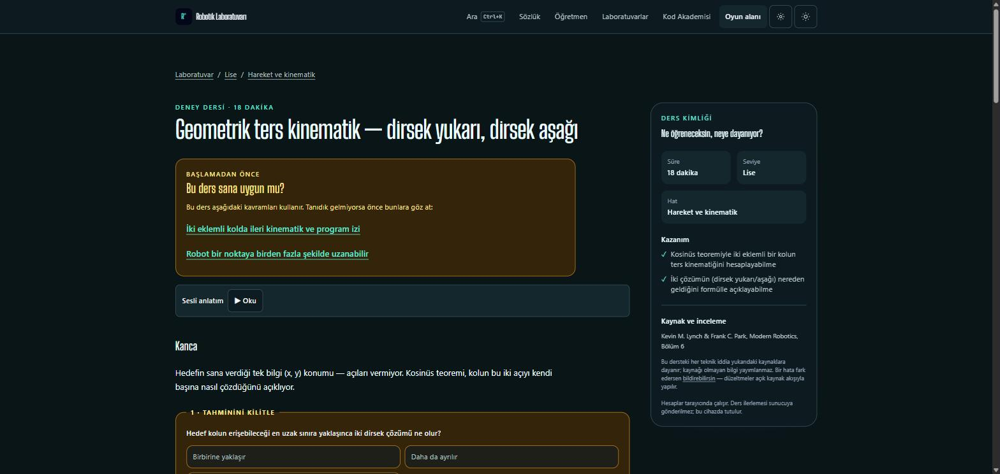

# Robotik Öğrenme Platformu

[](https://robotik-platform.vercel.app/)
[](https://github.com/Merd0/robotik-platform/actions/workflows/ci.yml)
[](LICENSE)
[](LICENSE-CONTENT)
[](package.json)

Robotiği tarayıcıda oynayarak öğreten, ortaokuldan mühendis seviyesine kadar
kademeli ilerleyen, açık ve ücretsiz bir Türkçe kaynak.

**[→ Canlı demoyu aç](https://robotik-platform.vercel.app/)** — hesap, kurulum
veya ödeme yok; direkt tarayıcıda dene.

Türkçe robotik kaynağı üç kategoriye sıkışmış durumda: kuru MEB PDF'leri,
bağlamsız üniversite slaytları ve ürün odaklı satıcı sayfaları. İngilizce
tarafta parçalar var ama dağınık — iyi müfredatlar video tabanlı ve ağır,
tarayıcıda çalışan simülatörlerde ise araç var ders yok. Bu proje şu dördün
kesişiminde duruyor: **seviyeli müfredat + tarayıcıda anında etkileşim +
endüstriyel gerçeklik (protokoller, robot dilleri, güvenlik) + Türkçe.**

## Ekran görüntüleri

| | |
|---|---|
|  |  |
| Ana sayfa — canlı iz laboratuvarı | 3B Robot Hücresi — altı eksenli kolu gerçek kinematik zinciriyle sür |
|  |  |
| Laboratuvarlar hub'ı — teşhis, kinematik ve keşif araçları | Bilgi haritası — 206 düğümlü, ders/terim/laboratuvar ilişki grafiği |
|  | |
| Ders sayfası — "önce tahmin et, sonra çalıştır, farkı gör" deseni | |

## Öne çıkanlar

Bu proje bir robot simülatörü değil, **kendi kalite kapılarını kendine
zorunlu kılan bir üretim hattı**:

- **94 ders, 3 seviye, 8 konu hattı** — ortaokuldan mühendisliğe kademeli,
  hepsi ön koşul grafiğiyle birbirine bağlı ve `npm run
  validate-content-graph` ile döngü/kopukluk denetimden geçiyor.
- **Matematik test edilmiş, uydurulmamış** — ileri/ters kinematik, Jacobian,
  yol planlama TypeScript'te; `reference-python/` altındaki Python/PyBullet
  fixture'larına karşı doğrulanıyor.
- **Yayın şartı olarak kaynak zorunluluğu** — `kaynaklar` alanı boş olan bir
  ders yayınlanamaz; bu hem doğruluk hem gizlilik koruması, CI ve git hook'u
  ile otomatik zorlanıyor.
- **Ölçülen performans ve erişilebilirlik** — Lighthouse erişilebilirlik
  100/100, performans bütçesi brotli byte cinsinden takip ediliyor; bir
  sayfa bütçeyi aştığında kök nedeni ölçülerek (varsayılarak değil)
  düzeltiliyor.
- **1056 otomatik test, sıfır sunucu bağımlılığı** — hesaplama tamamen
  tarayıcıda; kişisel veri, hesap, çerez veya üçüncü taraf izleyici yok.
- **İki bağımsız AI ajanının (Claude Code + Codex) denetim disipliniyle
  paralel çalışması** — kararlar ve gerekçeleri `docs/durum-denetim.md` ve
  `docs/durum-codex.md`'de tam kronolojik olarak kayıtlı; hiçbir "yayında"
  etiketi kanıtsız değil.

## Nasıl çalışır

- **Önce oyna, sonra oku.** Her ders etkileşimli bir sahneyle açılır; metin
  oynadıktan sonra "ne oldu"yu anlatır.
- **Kurulum yok.** Her şey tarayıcıda. İndirme, hesap, ödeme yok.
- **Hesaplama tarayıcıda.** İleri/ters kinematik, Jacobian, yol planlama,
  çarpışma kontrolü — hepsi TypeScript'te, `lib/robotics/` altında. Sunucuya
  istek gitmez. İleri derslerde öğrenci Pyodide ile gerçek Python yazar.
- **Kişisel veri toplanmaz.** Hesap, giriş, e-posta, çerez, üçüncü taraf
  izleyici yok. İlerleme yalnızca tarayıcının `localStorage`'ında durur.
  Hedef kitlede çocuklar var; bu karar tartışmaya kapalı.
- **İçerik koddan ayrı.** Ders eklemek `content/` altına bir MDX dosyası
  eklemektir, kod yazmak değil.

## Nerede

8 konu hattı, 3 seviye (ortaokul / lise / üniversite), **94 ders**, hepsi
`durum: yayinda`:

| Hat | Konu |
|---|---|
| A | Temeller |
| B | Hareket ve kinematik |
| C | Yol planlama |
| D | Robot programlama dilleri (RAPID, KRL, Mecademic, FANUC TP, ROS 2) |
| E | Haberleşme ve entegrasyon |
| F | Algılama: sensör ve görü |
| G | Simülasyon ve dijital ikiz |
| H | Güvenlik ve endüstriyel gerçeklik |

Sitede yalnızca `durum: yayinda` işaretli dersler listelenir. Bir dersin
yayınlanması, bir insanın onu kaynaklarıyla karşılaştırarak okumasını
gerektirir — bkz. aşağıda "Kalite".

## Kurulum

Node.js 20+ gerekir.

```bash
git clone https://github.com/Merd0/robotik-platform.git
cd robotik-platform
npm ci        # npm install değil — kilitli sürümler kullanılır
npm run dev   # http://localhost:3000
```

`npm run dev` ve `npm run build` başlamadan önce üç üretim adımı otomatik
koşar (`predev` / `prebuild`): Pyodide varlıklarının kopyalanması, Web
Worker'ların esbuild ile derlenmesi ve arama indeksinin üretilmesi. Bunların
çıktısı `public/` altına yazılır ve `.gitignore`'dadır — kaynak değil,
üretilen dosyadır. **Dosya izlemezler:** bir worker'ı veya ders metnini
değiştirip aramada görmek istersen dev sunucusunu yeniden başlat.

### Komutlar

```bash
npm run dev                     # geliştirme sunucusu
npm run build                   # statik dışa aktarım → out/
npm test                        # Vitest birim testleri
npm run lint
npx tsc --noEmit                # tip kontrolü
npm run check-content           # frontmatter + kaynaklar doğrulaması
npm run validate-content-graph  # ön koşul grafiği: döngü, eksik referans
npm run generate-fixtures       # Python referansından test verisi üret
```

CI (`.github/workflows/ci.yml`) her push ve PR'da bunların hepsini
(+ `npm audit --audit-level=high`) koşar.

## Yapı

```
app/           Next.js sayfaları (ders, seviye, /ara, /sozluk)
content/       TÜM DERS İÇERİĞİ — kod değil, veri (MDX + sozluk.json)
lib/robotics/  çekirdek matematik: transform, kinematics, collision,
               planners, safety — saf TypeScript, DOM/React importu yok
lib/           içerik okuma, ilerleme takibi, arama
components/
  scene/       3D sahneler (Three.js) — tembel yüklenir
  interactive/ derslere gömülen etkileşimli bloklar
  ui/          düğme, kart, navigasyon, arama kutusu
scripts/       içerik doğrulama, worker derleme, arama indeksi
reference-python/  Python + PyBullet: doğruluk kaynağı ve indirilebilir
                   alıştırma deposu
docs/          planlama dokümanları
```

`lib/robotics/` bilinçli olarak UI'dan bağımsız tutulur — ileride bir React
Native portu gerekirse olduğu gibi taşınabilsin diye. Oraya `window`,
`document` veya React importu girmez.

## Dokümanlar

Projenin kararları koda değil, `docs/` altına yazılır. Katkı yapacaksan
sırasıyla:

| Dosya | Ne anlatır |
|---|---|
| [`00-vizyon.md`](docs/00-vizyon.md) | Ne yapıyoruz, ne yapmıyoruz; kaynak gizliliği kuralı |
| [`01-mufredat.md`](docs/01-mufredat.md) | 8 konu hattı, 3 seviye, ders yapısı |
| [`02-mimari.md`](docs/02-mimari.md) | Teknik kararlar ve değişmez sözleşmeler |
| [`03-yol-haritasi.md`](docs/03-yol-haritasi.md) | Fazlar ve görev listesi |
| [`04-icerik-rehberi.md`](docs/04-icerik-rehberi.md) | **Ders nasıl yazılır** — şablon, seviye kalibrasyonu, kanca çeşitliliği |
| [`05-deneyim-ve-guvenlik.md`](docs/05-deneyim-ve-guvenlik.md) | Eğlence tasarımı, gizlilik, hız hedefleri |
| [`06-kalite-ve-topluluk.md`](docs/06-kalite-ve-topluluk.md) | Üç katmanlı içerik doğrulaması |
| [`07-tasarim-sistemi.md`](docs/07-tasarim-sistemi.md) | Görsel kimlik, tipografi, mobil |
| [`08-guvenlik-sertlestirme.md`](docs/08-guvenlik-sertlestirme.md) | Tedarik zinciri, PR güvenliği, HTTP başlıkları |
| [`09-ai-muhendisligi.md`](docs/09-ai-muhendisligi.md) | Üretim süreci; dal ve merge kuralı |
| [`durum-denetim.md`](docs/durum-denetim.md) | Claude Code'un faz faz denetim kaydı — neyin gerçekten doğrulandığı |
| [`durum-codex.md`](docs/durum-codex.md) | Codex'in ayrı worktree'lerde yürüttüğü paralel iş kaydı |

`docs/durum-denetim.md` ve `docs/durum-codex.md` özellikle önemli: bu
projede "yayında" statüsü tek başına "bir insan bunu satır satır okudu"
garantisi vermez. Hangi dersin gerçekten okunduğu, hangi ölçümün nasıl
yapıldığı ve hangi kararın neden alındığı bu iki dosyada kronolojik olarak
yazar.

## Kalite

Dersler büyük ölçüde yapay zeka yardımıyla yazılıyor. Bu hız kazandırır ama
doğruluk kanıtı değildir. İki otomatik kapı ve bir opsiyonel inceleme katmanı var
([`docs/06`](docs/06-kalite-ve-topluluk.md)):

1. **Sayısal doğrulama** — matematik iddiaları `reference-python/`
   fixture'larına ve birim testlerine karşı koşar.
2. **Kaynak zorunluluğu** — `kaynaklar` alanı boş olan bir ders yayınlanamaz.
   Bu aynı zamanda bir gizlilik korumasıdır: kaynağı gösterilemeyen bilgi
   yazılmaz. Bir CI kontrolü ve bir git hook'u bunu otomatik zorlar.
3. **İnsan gözden geçirmesi** — opsiyoneldir. Yapılırsa güncel ders sürümüne
   bağlı Review Receipt ile kaydedilir; legacy `incelendi_*` alanları yayın
   şartı veya güncel inceleme kanıtı değildir.

Bu ayrım bilinçlidir: otomatik kontroller kaynak alanının doluluğunu ve
sayısal kodu doğrular, ders metnindeki her iddianın kaynakla uyuştuğunu garanti
etmez. Hata bildirimleri açık düzeltme akışıyla ele alınır.

## Katkı

Ders, terim, bileşen, düzeltme — hepsi PR ile gelebilir. Süreç
[`CONTRIBUTING.md`](CONTRIBUTING.md)'de. Güvenlik açığı bulduysan issue açma,
[`SECURITY.md`](SECURITY.md)'ye bak.

## Lisans

Depoda iki lisans var:

- **Yazılım** (`app/`, `components/`, `lib/`, `scripts/`, `reference-python/`,
  yapılandırma) — MIT, bkz. [`LICENSE`](LICENSE)
- **İçerik ve dokümantasyon** (`content/`, `docs/`, düzyazı metinler) —
  CC BY-SA 4.0, bkz. [`LICENSE-CONTENT`](LICENSE-CONTENT)

Ölçüt: çalıştırılan şey MIT, okunan şey CC BY-SA. Ders içeriğindeki
AynıLisanslaPaylaş şartı bilinçli — birisi bu dersleri geliştirirse,
geliştirdiği hâli de aynı lisansla paylaşır; Türkçe kaynak havuzu büyür,
kapanmaz.

Derslerde atıf yapılan üçüncü taraf materyaller (ders kitapları, standartlar,
üretici dokümanları) bu lisansların dışındadır.
