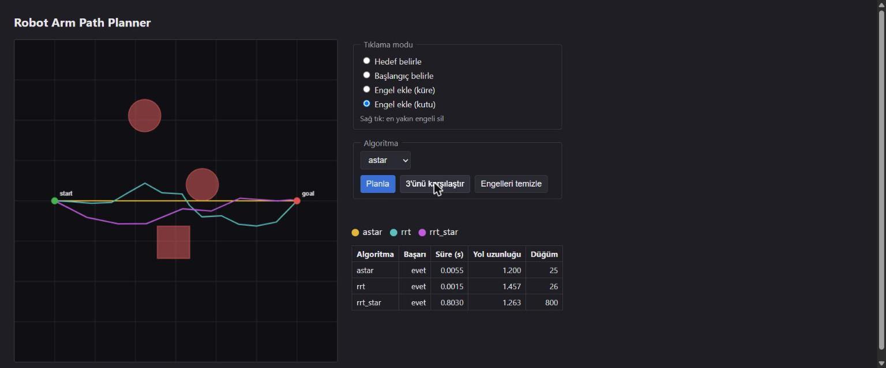

# Robot Arm Path Planner

Sanal bir robot kolunun engellerden kaçarak hedefe ulaşmasını sağlayan,
web arayüzünden kullanılabilen algoritma karşılaştırma aracı.

Üç farklı yol planlama algoritmasını (A*, RRT, RRT*) aynı sahnede çalıştırıp
süre, yol uzunluğu, düğüm sayısı ve başarı oranı açısından karşılaştırır.
Planlama, KUKA iiwa robotunun uç noktası (end-effector) için kartezyen
uzayda yapılır — kapsam ve bilinen kısıtlar için `docs/architecture.md`.



## Kurulum

```bash
python -m venv .venv
source .venv/bin/activate      # Windows: .venv\Scripts\activate
pip install -r requirements.txt
```

## Çalıştırma

```bash
pytest backend/tests/ -v                  # testler
python -m backend.benchmark               # algoritma karşılaştırması (results/benchmark.json)
uvicorn backend.api.main:app --reload     # API (http://localhost:8000)
python -m http.server 5500 --directory frontend   # web arayüzü (http://localhost:5500)
```

Web arayüzünü kullanmak için hem API'nin hem de statik sunucunun aynı anda
çalışıyor olması gerekir.

## Yapı

```
backend/kinematics/   forward.py, inverse.py — eklem açıları <-> uç nokta
backend/planners/     base.py (arayüz), astar.py, rrt.py, rrt_star.py, straight_line.py
backend/simulation/   scene.py (PyBullet sahne), obstacles.py (engel + çarpışma kontrolü)
backend/api/          main.py (FastAPI: POST /plan, GET /algorithms)
backend/benchmark.py  algoritma karşılaştırma scripti
frontend/             2D canvas arayüz (tek dosya, build adımı yok)
docs/                 plan.md, architecture.md, sonuclar.md, gunluk-loglar/
```

## Sonuçlar

Üç algoritmanın az/orta/çok engelli sahnelerdeki karşılaştırması ve kısa
analizi: `docs/sonuclar.md`.

## Durum

Aşama 0-8 tamamlandı (kurulum, simülasyon, kinematik, çarpışma kontrolü,
planlayıcı arayüzü, A*/RRT/RRT*, karşılaştırma, API, frontend). Aşama 9
(cila: demo videosu, staj defteri notları) sürüyor. Güncel görev listesi:
`docs/plan.md`.
